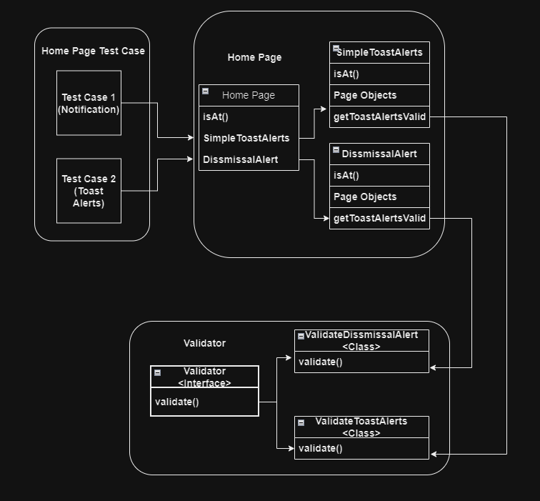

# Command Design Patterns


The Command Pattern is a behavioral design pattern used in software development to encapsulate a request as an object, allowing for parameterization and queuing of requests, logging of operations, and support for undoable actions. This pattern decouples the object that invokes the operation from the one that knows how to perform it.

In real life, a smart home system, a remote control is designed to manage various devices like lights, thermostat, and TV. Each button on the remote is associated with a specific command object. For example, pressing the "Lights On" button sends a command to turn on the lights, while the "Set Temperature" button sends a command to adjust the thermostat. These command objects encapsulate the actions and know how to interact with their respective devices. The remote control itself doesn't need to understand the details of how each device works; it only needs to invoke the commands. This separation simplifies adding new devices or changing functionalities without modifying the remote control's code, demonstrating the flexibility and scalability of the Command Pattern

## Implementation in Test Automation

In our test automation scenario, the home page consists of several sections, each requiring distinct validation steps. For instance, the Simple Toast Alerts section displays various alert messages when different actions are performed. Each alert needs to be verified for its correct message and behavior. Another section, Dismissal Alerts, contains alerts that disappear from the UI when clicked. Each alert must be checked to ensure it vanishes as expected upon interaction.

To efficiently validate these sections, we implement the Command Pattern. We define an interface, `Validate`, with a method `validate()`. Specific classes like `ValidateToastAlerts` and `ValidateDismissalAlert` implement this interface, providing the required validation logic for each section. The home page test script then creates instances of these classes and invokes their `validate()` methods. This approach decouples the validation logic for different sections, making the test script more modular, maintainable, and scalable.

Here is the diagram...



### Validator Interface:

```java
public interface Validator {
    boolean validate();
}
```

`ValidateToastAlerts` and `ValidateDismissalAlert` implement this interface.

### ValidateToastAlerts:

```java
public class ValidateToastAlerts implements Validator {

    private final WebElement alert_button;
    private final WebElement alert_toast;

    public ValidateToastAlerts(final WebElement alert_button, final WebElement alert_toast) {
        this.alert_button = alert_button;
        this.alert_toast = alert_toast;
    }

    @Override
    public boolean validate() {
        await().atMost(Duration.ofSeconds(2)).until(this.alert_button::isDisplayed);
        boolean isButtonDisplayed = this.alert_button.isDisplayed();
        this.alert_button.click();
        boolean isAlertToastAppear = this.alert_toast.isDisplayed();
        Uninterruptibles.sleepUninterruptibly(4, TimeUnit.SECONDS);
        boolean isAlertToastDisappear = this.alert_toast.isDisplayed();
        return isButtonDisplayed && isAlertToastAppear && (!isAlertToastDisappear);
    }
}
```

### ValidateDissmissalAlert:

```java
public class ValidateDissmissalAlert implements Validator {

    private final WebElement dissmissalAlert;

    public ValidateDissmissalAlert(final WebElement dissmissalAlert) {
        this.dissmissalAlert = dissmissalAlert;
    }

    @Override
    public boolean validate() {
        await().atMost(Duration.ofSeconds(2)).until(this.dissmissalAlert::isDisplayed);
        boolean isDissmissalAlertDisplayed = this.dissmissalAlert.isDisplayed();
        this.dissmissalAlert.findElement(By.cssSelector("button.close")).click();
        Uninterruptibles.sleepUninterruptibly(1, TimeUnit.SECONDS);
        boolean isDissmissalAlertDisappear;
        try {
            isDissmissalAlertDisappear = dissmissalAlert.isDisplayed();
        } catch (NoSuchElementException e) {
            isDissmissalAlertDisappear = false;
        }
        return isDissmissalAlertDisplayed && (!isDissmissalAlertDisappear);
    }
}
```

To manage the size and complexity of the home page class, we divide our page objects into separate modules and invoke them from the home page as needed.

### HomePage:

```java
public class HomePage extends BasePage {

    private static final Logger logger = LogManager.getLogger(HomePage.class);

    @FindBy(xpath = "//*[@class='row page-titles']//*[text()='Home']")
    private WebElement home_button;

    private SimpleToastAlerts simpleToastAlerts;
    private DissmissalAlert dissmissalAlert;

    public HomePage(WebDriver driver) {
        super(driver);
    }

    public SimpleToastAlerts getSimpleToastAlerts() {
        return new SimpleToastAlerts(this.driver);
    }

    public DissmissalAlert getDissmissalAlert() {
        return new DissmissalAlert(this.driver);
    }

    @Override
    public boolean isAt() {
        await().atMost(Duration.ofSeconds(20)).ignoreExceptions().until(home_button::isDisplayed);
        return home_button.isDisplayed();
    }
}
```

```java
public class SimpleToastAlerts extends BasePage {

    private static final Logger logger = LogManager.getLogger(SimpleToastAlerts.class);

    @FindBy(css = ".button-box button.btn-info")
    private WebElement button_info;

    @FindBy(css = "div.jq-icon-info")
    private WebElement info_alert;

    @FindBy(css = ".button-box button.btn-warning")
    private WebElement button_warning;

    @FindBy(css = "div.jq-icon-warning")
    private WebElement warning_alert;

    @FindBy(css = ".button-box button.btn-success")
    private WebElement button_success;

    @FindBy(css = "div.jq-icon-success")
    private WebElement success_alert;

    @FindBy(css = ".button-box button.btn-danger")
    private WebElement button_danger;

    @FindBy(css = "div.jq-icon-error")
    private WebElement danger_alert;

    public SimpleToastAlerts(WebDriver driver) {
        super(driver);
    }

    @Override
    public boolean isAt() {
        // Implement logic to check if the Simple Toast Alerts page is loaded
        return false; // Change this logic based on your actual implementation
    }

    public List<Validator> getToastAlertsValidator() {
        // Initialize validators for each type of alert
        return Arrays.asList(
                new ValidateToastAlerts(button_info, info_alert),
                new ValidateToastAlerts(button_warning, warning_alert),
                new ValidateToastAlerts(button_success, success_alert),
                new ValidateToastAlerts(button_danger, danger_alert)
        );
    }
}
```

```java
public class DissmissalAlert extends BasePage {

    private static final Logger logger = LogManager.getLogger(DissmissalAlert.class);

    @FindBy(xpath = "//*[@class='card-title' and text()='Dissmissal Alert']" +
            "/parent::*//div[contains(@class,'alert-success')]")
    private WebElement alert_success;

    @FindBy(xpath = "//*[@class='card-title' and text()='Dissmissal Alert']" +
            "/parent::*//div[contains(@class,'alert-danger')]")
    private WebElement alert_danger;

    @FindBy(xpath = "//*[@class='card-title' and text()='Dissmissal Alert']" +
            "/parent::*//div[contains(@class,'alert-warning')]")
    private WebElement alert_warning;

    @FindBy(xpath = "//*[@class='card-title' and text()='Dissmissal Alert']" +
            "/parent::*//div[contains(@class,'alert-info')]")
    private WebElement alert_info;

    public DissmissalAlert(WebDriver driver) {
        super(driver);
    }

    @Override
    public boolean isAt() {
        // Implement logic to check if the Dissmissal Alert page is loaded
        return false; // Change this logic based on your actual implementation
    }

    public List<Validator> getDissmissalAlertValidator() {
        // Initialize validators for each type of alert
        return Arrays.asList(
                new ValidateDissmissalAlert(alert_success),
                new ValidateDissmissalAlert(alert_danger),
                new ValidateDissmissalAlert(alert_warning),
                new ValidateDissmissalAlert(alert_info)
        );
    }

}
```

### Test Class:

```java
public class HomePageTest extends BaseTest {

    private static final Logger logger = LogManager.getLogger(HomePageTest.class);

    private HomePage homePage;
    private final String url = "https://vins-udemy.s3.amazonaws.com/ds/admin-template/admin-template.html";

    @BeforeTest
    public void setup() {
        this.homePage = new HomePage(this.driver);
    }

    @Test
    public void goTo() {
        logger.info("Navigating to URL: {}", url);
        this.driver.get(url);
        Assert.assertTrue(this.homePage.isAt(), "Unable to navigate to Home Page");
        logger.info("Successfully navigated to Home Page");
    }

    @Test(dependsOnMethods = "goTo", description = "Validate all Simple Toast Alerts")
    public void validateSimpleToastAlerts() {
        logger.info("Validating Simple Toast Alerts");
        this.homePage.getSimpleToastAlerts().getToastAlertsValidator()
                .stream().parallel()
                .map(validator -> validator.validate())
                .forEach(flag -> Assert.assertTrue(flag, "Unable to validate Simple Toast Alerts"));
        logger.info("Simple Toast Alerts validation completed");
    }

    @Test(dependsOnMethods = "validateSimpleToastAlerts", description = "Validate all Dismissal Alerts")
    public void validateDismissalAlert() {
        logger.info("Validating Dismissal Alerts");
        this.homePage.getDissmissalAlert().getDissmissalAlertValidator()
                .stream().map(validator -> validator.validate())
                .forEach(flag -> Assert.assertTrue(flag, "Unable to validate Dismissal Alerts"));
        logger.info("Dismissal Alerts validation completed");
    }

}
```

Applying Command Pattern in test automation enhances flexibility and maintainability by encapsulating actions as objects. In our example, the Command Pattern facilitated the validation of different alert functionalities on a web page. Each validation task (such as checking Simple Toast Alerts or Dismissal Alerts) was encapsulated in separate validator classes (`ValidateToastAlerts` and `ValidateDissmissalAlert`), which implemented a common `Validator` interface. This approach allowed the test script to invoke these validators dynamically and independently, simplifying the addition of new validation scenarios or modifications to existing ones without altering the core test logic. By decoupling the invoker (test script) from the concrete actions (validators), the Command Pattern promotes modularity, scalability, and easier maintenance of test automation suites.