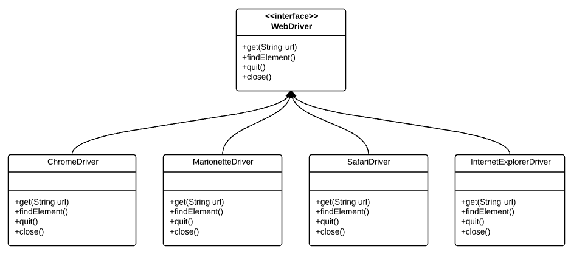
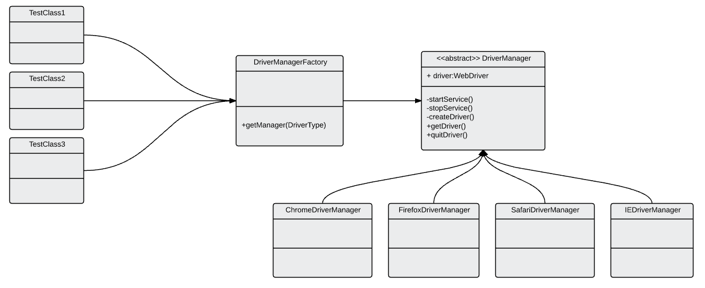

# Factory Design Pattern

## Introduction

Factory Pattern is one of the creation Patterns. It is mostly used when we need to create an object from one of several possible classes that share a common implements an interface. It creates objects without exposing the instantiation logic to the user. We, as the user, refer to the newly created object through a common interface.



Here interface is **WebDriver** and all these **Chrome/Firefox/Safari/IE** driver concrete classes implement this WebDriver interface. We are able to refer to the, ChromeDriver/FirefoxDriver etc, instance through the WebDriver interface without much change in the code.


## Problem in Creating WebDriver Instance:

Even though the above concrete classes implements a common interface, We need to follow different approaches in creating an instance from one of these concrete classes which depends on the browser instance we might want to use.

For ex: ChromeDriver requires a Driver Server setup but Firefox (till version 45) does not need anything.

```Java
WebDriver driver = new FirefoxDriver();
```

The above code simply works – but the below code might not unless we set driver server executable.

```Java
WebDriver driver = new ChromeDriver();
```

But we know how to solve!!

The easiest solution is – to put all the logic in a if else block!! right?


``` Java

if (Browser.equals("chrome")) {

    // logic to start the driver service
    // then to create driver etc

} else if (Browser.equals("firefox")) {

    // logic to start the driver service
    // then to create driver etc

} else if (Browser.equals("ie")) {


} else if (Browser.equals("safari")) {


} else if (Browser.equals("phantomjs")) {


}

```
It might look like an easy solution. But it is really NOT. When we have to start/stop the Driver Service ourselves, the code becomes significantly larger and very difficult to maintain. (This will create more boiler plate code and lots of if else blocks.)

## Factory Pattern in Creating WebDriver Instance:

The Factory Pattern can effectively address the issue mentioned by abstracting away the creation logic of WebDriver instances from the test classes, providing them with a simple interface to obtain the necessary driver instance. To implement this, we introduce an abstract class called DriverManager. Test classes can then utilize this abstract class to retrieve a WebDriver instance without needing to concern themselves with the specifics of how the drivers are actually created.

Here's a brief overview of the architecture:




