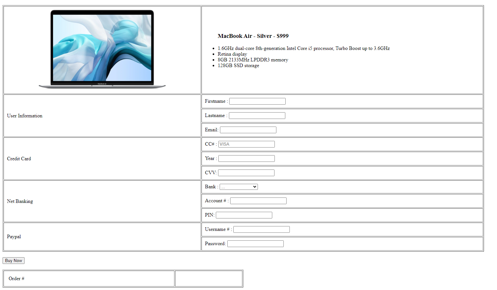
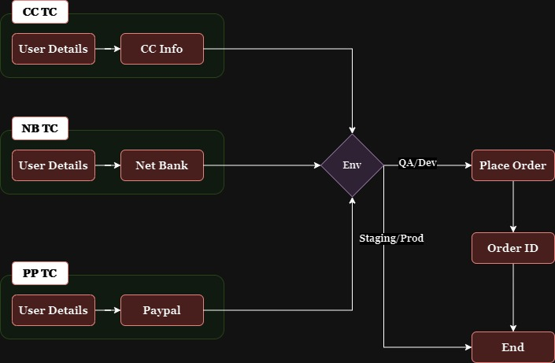

# Proxy Design Pattern


In the realm of test automation, the `Proxy Design Pattern` serves as a strategic approach to manage and control access to objects, particularly when working across different environments like `development, staging, and production`. At its core, the proxy pattern introduces a placeholder or intermediary object that stands in for the actual object, effectively controlling and sometimes restricting the operations performed on that object.

To draw a parallel from everyday scenarios, think of accessing the internet through an office network. Here, a proxy server might allow you to browse certain websites like `Google or StackOverflow`, but restrict access to others, like `social media platforms`. Although it appears as though you have direct access to the internet, the proxy server is actually mediating all requests, determining what is allowed and what is not.

This pattern is particularly beneficial in `test automation` where scripts are run across various environments. For instance, while certain operations, such as `placing or canceling orders`, may be permissible in a development environment, they might be restricted in staging or production due to limited user permissions. Traditionally, this challenge has been addressed using conditional logic within the test scripts, resulting in numerous `if-else` statements to handle different environments. However, this approach can lead to code that is difficult to maintain and prone to errors.

The `Proxy Design Pattern` offers a more elegant solution by allowing controlled access to objects without cluttering test scripts with environment-specific conditions. By implementing a proxy object, you can encapsulate the logic for environment-specific access control, thereby simplifying your test automation code and making it more robust and maintainable.

This pattern is invaluable when you need to manage access rights across various environments without compromising the integrity and reliability of your test automation framework.

`Still confused?` No Worries!


## Application overview



In the given application architecture, the workflow for automating the process of placing an order is structured to accommodate different payment methods and environment-specific conditions. Here's how the application flow is structured:




The automation process consists of the following steps:

### 1. User Details Input
The process begins by capturing the user's details. This step is common across all test cases and ensures that the necessary user information is gathered for the subsequent steps.

### 2. Payment Method Selection
Based on the test scenario, the user will be prompted to provide payment details. The payment method can vary as follows:

- **Credit Card Test Flow (CC TC)**: The user enters their credit card information.
- **Net Banking Test Flow (NB TC)**: The user provides their net banking details.
- **PayPal Test Flow (PP TC)**: The user submits their PayPal account information.

### 3. Environment Check
After the payment method is selected, the application checks the current environment where the test is being executed. This step is critical as it determines whether the order can be placed:

- **QA/Development**: If the environment is QA or Development, the system will proceed to place the order. Placing an order here does not have real-world implications.
- **Staging/Production**: If the environment is Staging or Production, the system will **not** proceed to place the order. These higher environments are closer to live conditions, and placing an order could have unintended consequences, so the action is restricted.

### 4. Order Placement
In the QA/Dev environment, after passing the environment check, the system proceeds to place the order. This involves processing the payment and confirming the transaction.

### 5. Order Confirmation
Once the order is placed in the QA/Dev environment, the system generates an Order ID, which serves as confirmation of the purchase.

### 6. End of Process
The process concludes after the order confirmation. In cases where the environment is Staging or Production, the process ends without placing the order.

## Code

Proxy design pattern allows us to create a wrapper/proxy class over a real object. Then this proxy class is used to provide controlled access to the real object. It is a very simple solution to restrict access!  More info on the below UML diagram is [here](https://github.com/codewithsitangshu/design-patterns/tree/main/proxy-pattern)

Lets see how we could use Proxy design pattern to solve our problem here. Lets first create an Interface with all the possible methods required for the Order Components.

```java
public interface OrderComponent {
    String placeOrder();
}
```

I have an Enum for `TestEnvironment`.

```java
public enum TestEnvironment {
    DEV,
    QA,
    STAGING,
    PROD
}
```

Lets create a real class which implements this interface! This class is responsible for placing order.

```java
public class OrderComponentReal implements OrderComponent {

    @FindBy(id = "buy")
    private WebElement buyNow;

    @FindBy(id = "ordernumber")
    private WebElement orderNumber;

    public OrderComponentReal(WebDriver driver){
        PageFactory.initElements(driver, this);
    }

    @Override
    public String placeOrder() {
        this.buyNow.click();
        return this.orderNumber.getText();
    }

}
```

Now Lets create a proxy class which implements the same interface!  This class contains a list of all the test environments which do not support Order execution.

```java
public class OrderComponentProxy implements OrderComponent {

    private static final List<TestEnvironment> restrictEnvironmentList;
    private OrderComponent orderComponent;

    static{
        restrictEnvironmentList = new ArrayList<>();
        restrictEnvironmentList.add(TestEnvironment.PROD);
        restrictEnvironmentList.add(TestEnvironment.STAGING);
    }

    public OrderComponentProxy(WebDriver driver){
        String currentEnv = System.getProperty("env"); // DEV / QA / PROD / STAGING
        if(!restrictEnvironmentList.contains(currentEnv.toUpperCase())){
            this.orderComponent = new OrderComponentReal(driver);
        }
    }

    @Override
    public String placeOrder() {
        if(Objects.nonNull(this.orderComponent)){
            return this.orderComponent.placeOrder();
        }else{
            return "SKIPPED";
        }
    }
}
```

My `PaymentScreen` class will look something like this. We always use the `OrderComponentProxy` class to create an instance of `OrderComponent`.

```java
public class PaymentScreen {

    private WebDriver driver;
    @Getter
    private UserInformation userInformation;
    @Getter
    private OrderComponent orderComponent;
    private PaymentOption paymentOption;

    public PaymentScreen(final WebDriver driver){
        this.driver = driver;
        this.userInformation = new UserInformation(this.driver);
        this.orderComponent = new OrderComponentProxy(this.driver);
    }

    public void setPaymentOption(PaymentOption paymentOption) {
        this.paymentOption = paymentOption;
        PageFactory.initElements(driver, this.paymentOption);
    }

    public void pay(Map<String, String> paymentDetails){
        this.paymentOption.enterPaymentInformation(paymentDetails);
    }

}
```

My Test class will look something like this. We pass the test environment for which we need to make a Order execution. Proxy class decides whether to create `OrderComponentReal` object or not – depends on the environment. So, if any of the test environment does not support Order execution, then it is simply skipped.

```java
public class PaymentScreenTest extends BaseTest {

    private PaymentScreen paymentScreen;
    private HomePage homePage;

    @BeforeTest(dependsOnMethods = "initDriver")
    public void setPaymentScreen(){
        System.setProperty("env", "QA");
        //System.setProperty("env", "PROD");
        this.homePage = new HomePage(this.driver);
        this.paymentScreen = new PaymentScreen(this.driver);
    }

    @Test(dataProvider = "getData")
    public void paymentTest(String option, Map<String, String> paymentDetails){
        this.homePage.goTo();
        Assert.assertTrue(this.homePage.isAt(), "Unable to navigate to Home Page");

        this.paymentScreen.getUserInformation()
                .enterDetails("sitangshu", "pal", "example@example.com");
        this.paymentScreen.setPaymentOption(PaymentOptionFactory.get(option));
        this.paymentScreen.pay(paymentDetails);
        String orderNumber = this.paymentScreen.getOrderComponent().placeOrder();

        System.out.println(
                "Order Number : " + orderNumber
        );
        Uninterruptibles.sleepUninterruptibly(3, TimeUnit.SECONDS);
    }

    @DataProvider
    public Object[][] getData(){

        Map<String, String> cc = Maps.newHashMap();
        cc.put("cc", "1231231231");
        cc.put("year", "2023");
        cc.put("cvv", "123");

        Map<String, String> nb = Maps.newHashMap();
        nb.put("bank", "WELLS FARGO");
        nb.put("account", "myaccount123");
        nb.put("pin", "999");

        return new Object[][]{
                {"CC", cc} ,
                {"NB", nb}
        };
    }
}
```

## Summary:

The Proxy Design Pattern is a powerful technique used to control access to an object by providing a placeholder or intermediary object. This pattern is particularly useful in test automation when running scripts across different environments, such as development (Dev), quality assurance (QA), staging, and production.

In the provided example, the application workflow involves filling out user details and selecting a payment method (Credit Card, Net Banking, or PayPal). However, the action of placing an order is contingent upon the environment in which the test is being executed:

- **In QA/Dev environments**: The order can be placed without restrictions, as these are lower-risk environments where real-world implications are minimal.
- **In Staging/Production environments**: The order placement is blocked to prevent unintended consequences in these higher-risk environments.

Traditionally, environment-specific logic would be handled using numerous `if-else` conditions, leading to complex and hard-to-maintain code. The Proxy Design Pattern simplifies this by encapsulating environment-specific access control within a proxy object, eliminating the need for repetitive conditional statements throughout the test scripts.

This approach not only streamlines the automation code but also ensures that operations are carried out safely and appropriately across different environments, making the Proxy Design Pattern an essential tool in a test automation architect's toolkit.
