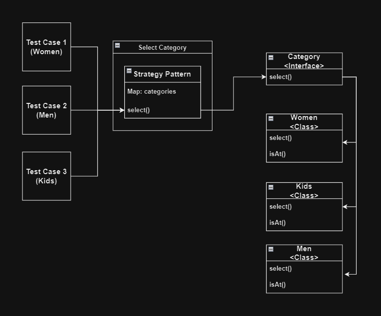

# Strategy Design Pattern


The Strategy Pattern is a powerful tool in software design, allowing us to define a range of algorithms for a particular task and encapsulate each one separately. By doing so, we make these algorithms interchangeable, providing flexibility to our applications. This pattern becomes invaluable when faced with scenarios where multiple algorithms can be utilized, but the specific choice may vary at runtime. With the Strategy Pattern, the algorithms can evolve independently from the code that employs them, enhancing maintainability and extensibility. Ultimately, it empowers developers to adapt and optimize their software's behavior without restructuring the entire system.

In the context of an eCommerce site offering dress selections for different categories such as Women, Men, and Kids, the Strategy Pattern proves invaluable for managing distinct flows while maintaining flexibility. Utilizing a common interface, `Category`, which declares a method for selecting categories, each specific category class—Women, Men, and Kids—implements this interface and defines its own selection process. This approach enables the `SelectCategory` class to dynamically choose the appropriate category based on user input. By encapsulating each category's behavior within separate classes, the Strategy Pattern promotes code organization, extensibility, and ease of maintenance. Thus, ensuring that regardless of the chosen category, the eCommerce site seamlessly accommodates diverse user preferences and navigates through tailored flows efficiently.

`Still confused?` No Worries!

Here is the diagram...




### Category Interface:

```java
public interface Category {
    boolean select();
}
```

### Base Page:

```java
public abstract class BasePage {

    protected final WebDriver driver;
    protected final WebDriverWait wait;

    public BasePage(WebDriver driver) {
        this.driver = driver;
        this.wait = new WebDriverWait(driver, Duration.ofSeconds(20));
        PageFactory.initElements(driver,this);
    }

    public abstract boolean isAt();

}
```

### To select `Men` as Category:

```java
public class Men extends BasePage implements Category {

    @FindBy(css = ".category-products #Men")
    private WebElement men_label;

    @FindBy(css = ".category-products a[href='#Men']")
    private WebElement men_link;

    public Men(WebDriver driver) {
        super(driver);
    }

    @Override
    public boolean isAt() {
        return false;  // Here you can write logic to validate page
    }

    @Override
    public boolean select() {
        men_link.click();
        Uninterruptibles.sleepUninterruptibly(1, TimeUnit.SECONDS);
        return men_label.getAttribute("class")
                .contains("in");
    }

}
```

### To select `Women` as Category:

```java
public class Women extends BasePage implements Category {

    @FindBy(css = ".category-products #Women")
    private WebElement women_label;

    @FindBy(css = ".category-products a[href='#Women']")
    private WebElement women_link;

    public Women(WebDriver driver) {
        super(driver);
    }


    @Override
    public boolean isAt() {
        return false; // Here you can write logic to validate page
    }

    @Override
    public boolean select() {
        women_link.click();
        Uninterruptibles.sleepUninterruptibly(1, TimeUnit.SECONDS);
        return women_label.getAttribute("class")
                .contains("in");
    }
}
```

### To select `Kids` as Category:

```java
public class Kids extends BasePage implements Category {

    @FindBy(css = ".category-products #Kids")
    private WebElement kids_label;

    @FindBy(css = ".category-products a[href='#Kids']")
    private WebElement kids_link;

    public Kids(WebDriver driver) {
        super(driver);
    }

    @Override
    public boolean isAt() {
        return false; // Here you can write logic to validate page
    }

    @Override
    public boolean select() {
        kids_link.click();
        Uninterruptibles.sleepUninterruptibly(1, TimeUnit.SECONDS);
        return kids_label.getAttribute("class")
                .contains("in");
    }

}
```

### SelectCategory

This class select category based on strategy pattern.

```java
public class SelectCategory {

    private final Map<String, Category> categories = new HashMap<>();

    public SelectCategory(WebDriver driver) {
        categories.put("Women",new Women(driver));
        categories.put("Men",new Men(driver));
        categories.put("Kids",new Kids(driver));
    }

    public boolean select(String category) {
        return categories.get(category).select();
    }

}
```

### Test Class

`Base Test`

```java
public class BaseTest {

    private DriverManager driverManager;
    protected WebDriver driver;

    @BeforeSuite
    public void beforeTest() {
        driverManager = DriverModule.getManager(DriverType.CHROME);
    }

    @BeforeTest
    public void beforeMethod() {
        driver = driverManager.getDriver();
    }

    @AfterTest
    public void afterTest() {
        driverManager.quitDriver();
    }

    @AfterSuite
    public void afterSuite() {
        driverManager.stopService();
    }

}
```

`SelectCategoryTest`

```java
public class SelectCategoryTest extends BaseTest {

    private HomePage homePage;
    private SelectCategory selectCategory;

    @BeforeMethod
    public void init() {
        this.homePage = new HomePage(this.driver);
        this.selectCategory = new SelectCategory(this.driver);
    }

    @Test
    public void goTo() {
        this.homePage.goTo();
        driver.manage().window().maximize();
        Assert.assertTrue(this.homePage.isAt(), "Unable to navigate to Home Page");
    }

    @Test(dependsOnMethods = "goTo", dataProvider = "dp")
    public void selectCategory(String category) {
        Assert.assertTrue(this.selectCategory.select(category),
                "unable to select category as : " + category);
    }

    @DataProvider
    public Object[] dp() {
        return new String[]{"Women", "Men", "Kids"};
    }
}
```

## Summary

The Strategy Pattern within our eCommerce platform discreetly manages various category selection processes, encapsulating them within the respective Women, Men, and Kids classes. This design empowers test cases to seamlessly choose their desired category selection method, fostering flexibility in our application. When we anticipate the need for new category selection strategies, the implementation merely involves creating new classes that adhere to the shared 'Category' interface. This approach circumvents the need for modifications to existing code, safeguarding against unintended errors. Leveraging composition, our eCommerce platform delegates category selection tasks efficiently, ensuring adaptability and ease of maintenance.

In the realm of eCommerce, Design Patterns serve as indispensable aids for enhancing communication and problem-solving efficiency. The mere mention of a pattern conjures a vivid mental representation of the design structure, facilitating rapid comprehension and solution formulation. Consequently, Design Patterns become invaluable tools for articulating and comprehending complex eCommerce designs, fostering clarity and efficacy in development endeavors.